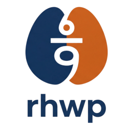
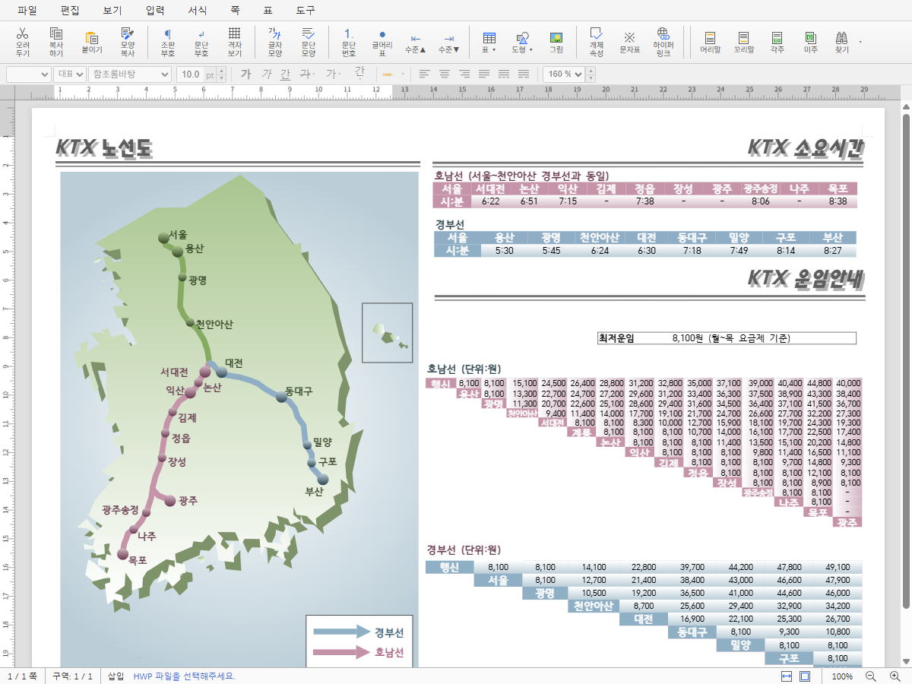
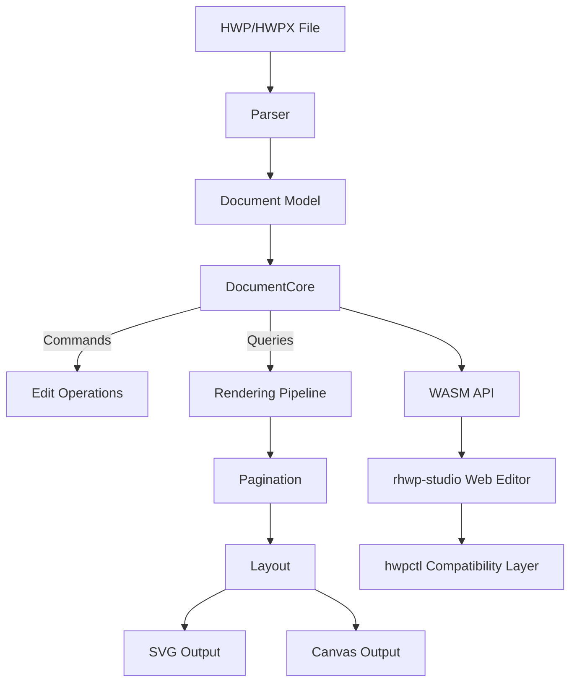

<p align="center">
  
</p>

<h1 align="center">rhwp</h1>

<p align="center">
  <strong>알(R), 모두의 한글</strong> — 알에서 시작하다<br/>
  <em>All HWP, Open for Everyone</em>
</p>

<p align="center">
  <a href="https://github.com/edwardkim/rhwp/actions/workflows/ci.yml"></a>
  <a href="https://edwardkim.github.io/rhwp/"></a>
  <a href="https://www.npmjs.com/package/@rhwp/core"></a>
  <a href="https://marketplace.visualstudio.com/items?itemName=edwardkim.rhwp-vscode"></a>
  <a href="https://opensource.org/licenses/MIT"></a>
  <a href="https://www.rust-lang.org/"></a>
  <a href="https://webassembly.org/"></a>
</p>

<p align="center">
  <strong>한국어</strong> | <a href="README_EN.md">English</a>
</p>

---

HWP/HWPX 파일을 **어디서든** 열어보세요. 무료, 설치 없이.

rhwp는 Rust + WebAssembly 기반의 오픈소스 HWP/HWPX 뷰어/에디터입니다. 닫힌 포맷의 벽을 깨고, 모든 사람, 모든 AI, 모든 플랫폼에서 한글 문서를 자유롭게 읽고 쓸 수 있게 합니다.

> **[온라인 데모](https://edwardkim.github.io/rhwp/)** | **[VS Code 확장](https://marketplace.visualstudio.com/items?itemName=edwardkim.rhwp-vscode)** | **[Open VSX](https://open-vsx.org/extension/edwardkim/rhwp-vscode)**

<p align="center">
  
</p>

## 로드맵

혼자 뼈대를 세우고, 함께 살을 붙이고, 모두의 것으로 완성한다.

```
0.5 ──── 1.0 ──── 2.0 ──── 3.0
뼈대      조판      협업      완성
```

| 단계 | 방향 | 전략 |
|------|------|------|
| **0.5 → 1.0** | 읽기/쓰기 기반 위에 조판 엔진 체계화 | 핵심 아키텍처를 혼자 견고하게 |
| **1.0 → 2.0** | AI 조판 파이프라인 위에 커뮤니티 참여 개방 | 기여 진입 장벽을 낮추는 구조 |
| **2.0 → 3.0** | 커뮤니티가 채운 기능 위에 공공 자산화 | 한컴 대등 수준 달성 |

> 0.5.0까지 혼자 뼈대를 완성하고 공개하는 이유 — 커뮤니티가 붙었을 때 방향이 흔들리지 않으려면 핵심 아키텍처가 먼저 견고해야 합니다.

## 이정표

### v0.5.0 ~ v0.7.x — 뼈대 (현재)

> 역공학 완성, 읽기/쓰기 기반 구축

- HWP 5.0 / HWPX 파서, 문단·표·수식·이미지·차트 렌더링
- 페이지네이션 (다단 분할, 표 행 분할), 머리말/꼬리말/바탕쪽/각주
- SVG 내보내기 (CLI) + Canvas 렌더링 (WASM/Web)
- 웹 에디터 + hwpctl 호환 API (30 Actions, Field API)
- 1,100+ 테스트

#### v0.7.17 사이클 (2026-06-23)

> v0.7.16 후속 patch — OOXML 차트 렌더 정합 첫 작업, legacy 도형 shapeComment 직렬화,
> WASM options object API, rhwp-studio 표/그림/커서 편집 정합, 의존성 일괄 업데이트

**렌더링 · 차트**
- OOXML 차트 7종(3D막대·3D원형·ofPie) 2D 근사 라우팅 + 막대 누적/백분율 보정 (C1a)
- Text IR v2 폰트 fallback 권위 유지, CanvasKit replay 계약 가드 확장

**저장 계약 · API**
- legacy 도형(ellipse/arc/polygon/curve/chart/ole) shapeComment 직렬화 누락 정정
- WASM options object API(`*Ex`) 26종 추가(하위 호환), 소비자 README/매뉴얼 보강

**rhwp-studio · 확장**
- 표 줄/칸 입력·지우기 회귀 보정, 미저장 문서 자동 백업·복구, 로컬 글꼴 동의, 그림/커서 정합, 표 셀 편집·보호
- 브라우저 확장 0.2.6: viewer CSP 정정, Chrome 다운로드 interceptor 부작용 제거

#### v0.7.16 사이클 (2026-06-19)

> v0.7.15 후속 patch — HWPX 저장 계약(serializer fidelity) 정밀화, 누름틀 안내문 한컴 호환,
> rhwp-studio 드래그&드롭 보안 게이트, 렌더·표·그림 정합과 외부 기여자 PR 다수 반영

**HWPX 저장 계약 (serializer fidelity)**
- 셀·글상자 컨트롤·lineseg·캡션 보존, secPr 여백·본문 단(colPr) IR 치환(템플릿 하드코딩 제거)
- 그림 크기·MEMO·shapeComment·등록 축·표 pageBreak 보존, DocInfo·numbering 등 무손실 라운드트립 보강
- 파서 autoNum 폭 일관화, newNum 슬롯 위치 정정, 열거 속성 표면 표기 정합 검사

**한컴 호환 · rhwp-studio**
- 누름틀(클릭하여 입력) 안내문 command 포맷 정정 — 한컴 편집기 안내문 바인딩 해소
- 드래그&드롭 로컬 파일 로딩 보안 게이트(모달 확인 opt-in, 확장/웹 공통), 누름틀 편집·다크테마

**렌더링 · 기타**
- native PDF export API, Text IR v2 폰트 증명 게이트, 미주 높이 SSOT, 회전 셀 그림 배치
- 차트 샘플 코퍼스 27종 검증 fixture, 인쇄 시 혼합 용지 크기 보존

#### v0.7.15 사이클 (2026-06-06)

> 보안 패치 — 브라우저 확장 service worker fetch 경로 hardening, 수식 TAC 흐름·커서 이동 보정,
> HWPX 저장 계약 후속 보강, 확장 v0.2.4 배포 준비

**브라우저 확장 보안**
- Chrome/Firefox service worker의 문서 fetch sender 검증, 내부망/localhost/private URL 차단, redirect 최종 URL 재검증 보강
- extension-side fetch에 `credentials: "omit"` 적용, 자동 thumbnail 데이터의 page DOM 직접 노출 방어
- Chrome/Edge/Firefox 확장 v0.2.4: 새 권한 없음, 새 외부 네트워크 endpoint 없음

**수식·미주 흐름**
- 수식 TAC-only 라인의 자동 줄넘김과 문단 들여쓰기 적용 보강
- 강제 줄넘김 뒤 TAC 수식 커서 이동, 미주 영역 커서 이동, 문단 간 이동 회귀 정정

**HWPX 저장 계약**
- HWPX 그림 직렬화 flip/rotation 및 `isEmbeded` 출력 정정
- HWPX 대각선 셀 테두리 `hh:slash` / `hh:backSlash` type 보존
- zero-length HWPX field ordering 보존

#### v0.7.13 사이클 (2026-05-18 ~ 2026-05-26)

> HWPX 렌더링/저장 호환성 집중 정정, 시험지·공공기관 문서군 회귀 해소, 브라우저 확장 v0.2.3 배포 준비

**HWPX → HWP 저장 호환성**
- 표/셀 axis contract, cell LIST_HEADER materialization, gradient `BORDER_FILL`, 셀 안쪽 여백, 셀 배경 이미지 채우기 유형 저장 정합 개선
- 메모 컨트롤 직렬화, 메모 스타일 보존, 목차 필드 마커/페이지 표기 출력, 페이지 번호 감추기/새 페이지 번호 시작 컨트롤 저장 보강
- `hwpx-h-01/02/03`, `mel-001`, `aift`, `exam_kor`, `exam_social` 계열 한컴 파일손상/중단 케이스 다수 해소

**HWPX 렌더링 정합**
- 바탕쪽(짝수/홀수/마지막), 머리말/꼬리말, 문단번호, 문단 테두리, 시험지 지문 박스 렌더링 보강
- 글상자 위치, 그라데이션, 사각형 모서리 곡률 처리 개선
- `exam_kor.hwpx`, `exam_social.hwpx`, `hwp3-sample16-hwp5.hwpx` 등 한컴 변환본과의 SVG/웹 캔버스 시각 정합 개선

**페이지네이션·조판 정정**
- HWPX `treat_as_char` 표 LINE_SEG 높이 과대 계산, 중첩 표 페이지 분할, 그림 pushdown/vpos 이중 계상, 다단 미주 vpos 처리 보강
- TAC 도형 커서 이동 및 연속 공백 이동 경험 개선

**배포·확장**
- `@rhwp/core` / `@rhwp/editor` v0.7.13 npm 배포
- GitHub Release `v0.7.13`에 Linux/macOS/Windows CLI 바이너리와 SHA-256 체크섬 첨부
- rhwp-chrome / Edge / Firefox 확장 v0.2.3: 로컬 `file://` 접근 권한 안내, Chrome/Edge 로컬 파일 중복 다운로드 억제, rhwp core 0.7.13 WASM 번들 반영

#### v0.7.12 사이클 (2026-05-12 ~ 2026-05-18)

> v0.7.11 후속 patch 사이클 — 외부 기여자 PR 19건 + @jangster77 PR 시리즈 7건 흡수

**핵심 회귀 정정**
- 원 Issue #952를 5개 독립 결함으로 분리해 완결: 쪽 테두리 기준, 빈 caption phantom advance, column 기준 그림 advance, line break 직전 inline TAC line 매핑, 글상자 내부 inline equation duplicate emit
- WMF `SetTextAlign` vertical bits 해석 정정, HWP3 빈 문단 + 쪽나누기 overflow 페이지 수 inflate 정정
- release 빌드 LTO / `codegen-units=1` / strip 적용으로 CLI 및 WASM 산출물 크기 감소

**rhwp-studio / API**
- F5 본문 블록 선택, F3 영역 확장, 메뉴 hotkey 인프라, 쪽 새 번호로 시작 UI/API 보강
- `searchAllText` API, `rhwpDev.goto()` 개발 도구, 문서 비교·이력 1차 기능 도입
- 저장되지 않은 변경사항 보호, 외부 클립보드 붙여넣기 우선순위, 중첩 표 hit-test 등 편집 안정성 보강

**HWP3/WMF/EMF/조판**
- EMF/WMF image 콘텐츠 렌더링, HWP3 탭 spec 정합, HWP3/HWPX 외부 참조 이미지 정합 보강
- 머리말/꼬리말 picture 회전·대칭, 바탕쪽 표 margin, 수식 Canvas/WASM 렌더, 다단 마지막 단 흐름 등 다수 회귀 정정

**기여자 감사**
- 본 사이클 기여자: [@jangster77](https://github.com/jangster77), [@oksure](https://github.com/oksure), [@planet6897](https://github.com/planet6897), [@seo-rii](https://github.com/seo-rii), [@postmelee](https://github.com/postmelee), [@johndoekim](https://github.com/johndoekim), [@ubermensch1218](https://github.com/ubermensch1218), [@xogh3198](https://github.com/xogh3198), [@dragonnite1221-lgtm](https://github.com/dragonnite1221-lgtm)

#### v0.7.11 사이클 (2026-05-10 ~ 2026-05-11)

> v0.7.10 후속 patch 사이클 — Skia native raster, HWP3 native 렌더링, rhwp-studio 편집 상호작용 집중 보강

**렌더링 / 조판**
- Skia native raster Issue #536 단계 진전: Layer IR contract hardening, text replay parity, Text IR v2 compatibility contract
- HWP3 native 렌더링 정합 보강: `hwp3-sample10.hwp` Oracle 763 페이지 기반 다단계 정정
- Git LFS `pdf-large/` 격리와 대형 fixture 운용 방식 정리

**rhwp-studio 편집 UX**
- scrollbar drag, 한글 IME chord 키 판별, Chrome 예약 단축키 회피를 위한 `Ctrl+N → Ctrl+M` 조정
- Alt/Option+Arrow 단어 이동, 표 셀 드래그 시 셀 컨텍스트 보존, 줄 끝/문서 끝 커서 이동 정정
- 표 편집 Undo/Redo, 표 크기 조절 SnapshotCommand, 다단/새 번호 dialog, Ctrl/Cmd+Arrow / Ctrl+E 단축키 보강

**기여자 감사**
- 본 사이클 기여자: [@planet6897](https://github.com/planet6897), [@oksure](https://github.com/oksure), [@jangster77](https://github.com/jangster77), [@seo-rii](https://github.com/seo-rii), [@postmelee](https://github.com/postmelee), [@johndoekim](https://github.com/johndoekim), [@kihyunnn](https://github.com/kihyunnn)

#### v0.7.10 사이클 (2026-05-06)

> v0.7.9 후속 patch 사이클 — 외부 기여자 7명 흡수, AI/VLM PNG 파이프라인, CLI 바이너리 릴리즈 파이프라인 도입

**신규 기능 / 인프라**
- Linux/macOS/Windows CLI 바이너리 GitHub Release 자산과 SHA-256 체크섬 첨부 파이프라인 도입
- native Skia 기반 `PageLayerTree → PNG` export, `native-skia` feature gate, `DocumentCore::render_page_png_native(page)` API 추가
- `export-png` CLI, `--vlm-target claude`, `--scale`, `--max-dimension`, `--font-path` 옵션과 한/영 매뉴얼 보강

**조판 / 렌더링 정정**
- HWP3 Square wrap 보완, HWP3 변환본 식별 휴리스틱, HWP 5.0 스펙 0x18/0x1E swap 정정
- 셀 inline TAC Shape margin + indent, TAC 표 `outer_margin_bottom`, 인라인 표+수식 단락 편위, 보기 셀 분수 단락 라우팅, 셀 내부 TopAndBottom 이미지 1라인 오프셋 정정
- PUA SVG 출력, exam_eng 화살표 누락, Square wrap 표 `horz_rel_to=Column`, 인라인 수식 미렌더 정정

**기여자 감사**
- 본 사이클 기여자: [@planet6897](https://github.com/planet6897), [@oksure](https://github.com/oksure), [@jangster77](https://github.com/jangster77), [@seo-rii](https://github.com/seo-rii), [@postmelee](https://github.com/postmelee), [@johndoekim](https://github.com/johndoekim), [@cskwork](https://github.com/cskwork)

#### v0.7.9 사이클 (2026-05-01 ~ 2026-05-02)

> Task #501 (cell.padding 한컴 방어 로직 모방) + Task #509 (PUA 글머리표 회귀) + PR #428/#494/#478/#498/#506/#510 cherry-pick + 외부 기여자 6명 흡수

**회귀 정정 (메인테이너)**
- mel-001.hwp 2쪽 표 셀 높이 회귀 정정 ([#501](https://github.com/edwardkim/rhwp/issues/501)) — 비정상 큰 cell.padding (1700 HU vs cell.height 1280 HU) 의 한컴 자체 방어 로직 모방 가드 추가. 트러블슈팅 + 위키 ([HWP 셀 Padding 방어 로직](https://github.com/edwardkim/rhwp/wiki/HWP-%EC%85%80-Padding-%EB%B0%A9%EC%96%B4-%EB%A1%9C%EC%A7%81)) 작성
- PUA (Private Use Area) 글머리표 글리프 회귀 정정 ([#509](https://github.com/edwardkim/rhwp/issues/509)) — Option F (PR #251 draw_text 영역 보존 + 매핑 표 한컴 PDF 정답지 정확화). 정정 매핑 2건 + 신규 매핑 10건 + `gen-pua` 검증 도구 추가

**외부 PR cherry-pick (5 건)**
- 그룹 내 그림(Picture) 직렬화 구현 (외부 기여 by [@oksure](https://github.com/oksure) — PR [#428](https://github.com/edwardkim/rhwp/pull/428))
- `Paragraph::utf16_pos_to_char_idx` 외부 노출 ([#484](https://github.com/edwardkim/rhwp/issues/484)) — 외부 기여 by [@DanMeon](https://github.com/DanMeon), PR [#494](https://github.com/edwardkim/rhwp/pull/494)
- Layout 정합 + 수식 정정 합본 (7 Task / 10 commits — #488/#490/#483/#489/#495/#480/#476) — 외부 기여 by [@planet6897](https://github.com/planet6897), PR [#478](https://github.com/edwardkim/rhwp/pull/478)
- HWP 3.0 파서 + Square wrap 어울림 렌더링 (Task #417 + Task #460, 51 commits) — 외부 기여 by [@jangster77](https://github.com/jangster77), PR [#506](https://github.com/edwardkim/rhwp/pull/506)
- PageLayerTree image paint op 에 brightness/contrast JSON 필드 추가 ([#508](https://github.com/edwardkim/rhwp/issues/508)) — alhangeul-macos downstream 의 backend replay contract 보강. 외부 기여 by [@postmelee](https://github.com/postmelee), PR [#510](https://github.com/edwardkim/rhwp/pull/510)

**회귀 검증 인프라 (외부 기여)**
- Canvas visual diff 파이프라인 (legacy Canvas ↔ PageLayerTree replay 픽셀 diff 자동 검증, relates [#364](https://github.com/edwardkim/rhwp/issues/364)) — 외부 기여 by [@seo-rii](https://github.com/seo-rii), PR [#498](https://github.com/edwardkim/rhwp/pull/498)

#### v0.7.8 사이클 (2026-04-29)

> 외부 컨트리뷰터 다수 + 메인테이너 회귀 정정 + 위키/README 정비 — 외부 PR 15건 cherry-pick

- 다단 섹션 누적 공식 회귀 정정 ([#391](https://github.com/edwardkim/rhwp/issues/391)) — 외부 기여 by [@planet6897](https://github.com/planet6897)
- 수식 렌더링 개선 ([#174](https://github.com/edwardkim/rhwp/issues/174), [#175](https://github.com/edwardkim/rhwp/issues/175)) + 그림 밝기/대비 효과 ([#150](https://github.com/edwardkim/rhwp/issues/150)) — 외부 기여 by [@oksure](https://github.com/oksure)
- 수식 ATOP 파싱 + HWPX 수식 직렬화 보존 ([#286](https://github.com/edwardkim/rhwp/issues/286)) — 외부 기여 by [@cskwork](https://github.com/cskwork) (본 저장소 첫 외부 컨트리뷰터)
- Canvas → PageLayerTree replay 전환 P2 — 외부 기여 by [@seo-rii](https://github.com/seo-rii) (PR [#456](https://github.com/edwardkim/rhwp/pull/456))
- WASM API 확장 (insertParagraph / deleteParagraph, [#269](https://github.com/edwardkim/rhwp/issues/269), [#271](https://github.com/edwardkim/rhwp/issues/271)) + set_field 라운드트립 정정 — 외부 기여 by [@oksure](https://github.com/oksure)

#### v0.7.7 사이클 (2026-04-27)

> v0.7.6 회귀 정정 — TypesetEngine 페이지네이션 fit drift / page_num 갱신 / PartialTable + Square wrap 처리 8항목 누적 정정 ([#354](https://github.com/edwardkim/rhwp/issues/354), [#359](https://github.com/edwardkim/rhwp/issues/359), [#361](https://github.com/edwardkim/rhwp/issues/361), [#362](https://github.com/edwardkim/rhwp/issues/362))

#### v0.7.6 사이클 (2026-04-26)

**외부 기여자 다수 + 조판 정밀화**
- 목차 리더 도트 + 페이지번호 우측 탭 정렬 ([#279](https://github.com/edwardkim/rhwp/issues/279)) — 외부 기여 by [@seanshin](https://github.com/seanshin), PR [#282](https://github.com/edwardkim/rhwp/pull/282)
- form-002 인너 표 페이지 분할 결함 ([#324](https://github.com/edwardkim/rhwp/issues/324)) — 외부 기여 by [@planet6897](https://github.com/planet6897), PR [#327](https://github.com/edwardkim/rhwp/pull/327)
- typeset 경로 PageHide / Shape / 중복 emit 결함 ([#340](https://github.com/edwardkim/rhwp/issues/340)) — 외부 기여 by [@planet6897](https://github.com/planet6897), PR [#341](https://github.com/edwardkim/rhwp/pull/341)
- Task #321~#332 누적 정리 + vpos / cell padding 회귀 해소 ([#342](https://github.com/edwardkim/rhwp/issues/342)) — 외부 기여 by [@planet6897](https://github.com/planet6897), PR [#343](https://github.com/edwardkim/rhwp/pull/343)

**API · 출력 (외부 기여 by [@oksure](https://github.com/oksure))**
- `replaceOne(query, newText, caseSensitive)` WASM API 추가 ([#268](https://github.com/edwardkim/rhwp/issues/268), PR [#334](https://github.com/edwardkim/rhwp/pull/334))
- SVG/HTML `draw_image` base64 임베딩 (PR [#335](https://github.com/edwardkim/rhwp/pull/335))

**Firefox AMO (외부 기여 by [@postmelee](https://github.com/postmelee) — PR [#339](https://github.com/edwardkim/rhwp/pull/339))**
- AMO 검증 워닝 해소 + viewer 번들 보안 sanitize → rhwp-firefox 0.2.2

---

#### 최근 변경 (v0.7.3 / 확장 v0.2.1, 2026-04-19)

**rhwp-studio (라이브러리 0.7.3)**
- HWPX 출처 문서 저장 비활성화 + 사용자 안내 ([#196](https://github.com/edwardkim/rhwp/issues/196)) — 데이터 손상 방지 (HWPX→HWP 완전 변환기 [#197](https://github.com/edwardkim/rhwp/issues/197) 완성 시까지)
- HWPX→HWP IR 매핑 어댑터 자산 보존 ([#178](https://github.com/edwardkim/rhwp/issues/178)) — rhwp 자기 호환 100% 회복, 한컴 호환은 #197 후속
- 회전된 도형 리사이즈 커서 개선 + Flip 처리 (외부 기여 by [@bapdodi](https://github.com/bapdodi) — PR [#192](https://github.com/edwardkim/rhwp/pull/192))
- HWP 그림 효과(그레이스케일/흑백) SVG 반영 (외부 기여 by [@marsimon](https://github.com/marsimon) — PR [#149](https://github.com/edwardkim/rhwp/pull/149))
- Windows 환경의 CFB 경로 구분자 오류 수정 (외부 기여 by [@dreamworker0](https://github.com/dreamworker0) — PR [#152](https://github.com/edwardkim/rhwp/pull/152))
- HWPX Serializer 구현 — Document IR → HWPX 저장 (외부 기여 by [@seunghan91](https://github.com/seunghan91) — PR [#170](https://github.com/edwardkim/rhwp/pull/170))
- HWPX ZIP 엔트리 압축 한도 + strikeout shape 화이트리스트 (외부 기여 by [@seunghan91](https://github.com/seunghan91) — PR [#153](https://github.com/edwardkim/rhwp/pull/153), PR [#154](https://github.com/edwardkim/rhwp/pull/154))
- 도형 리사이즈 시 너비/높이 클램프 (외부 기여 by [@seunghan91](https://github.com/seunghan91) — PR [#163](https://github.com/edwardkim/rhwp/pull/163))
- 모바일 드롭다운 메뉴 아이콘/라벨 겹침 수정 (외부 기여 by [@seunghan91](https://github.com/seunghan91) — PR [#161](https://github.com/edwardkim/rhwp/pull/161))

**rhwp-chrome / Edge 확장 (v0.2.1)**
- Chrome 확장 활성 시 일반 파일 다운로드의 마지막 위치 기억 동작 복원 ([#198](https://github.com/edwardkim/rhwp/issues/198))
- 옵션 페이지 CSP 호환 수정 ([#166](https://github.com/edwardkim/rhwp/issues/166))
- HWP 파일 `Ctrl+S` 시 같은 파일 직접 덮어쓰기 (외부 기여 by [@ahnbu](https://github.com/ahnbu) — PR [#189](https://github.com/edwardkim/rhwp/pull/189))
- 썸네일 로딩 스피너 정리 + options CSP 호환 (외부 기여 by [@postmelee](https://github.com/postmelee) — PR [#168](https://github.com/edwardkim/rhwp/pull/168))
- DEXT5 류 핸들러 다운로드 시 빈 뷰어 탭 차단

**기여자 감사**
v0.7.x 배포 주기 누적 외부 기여자: [@ahnbu](https://github.com/ahnbu), [@bapdodi](https://github.com/bapdodi), [@cskwork](https://github.com/cskwork), Dangel, [@DanMeon](https://github.com/DanMeon), [@dragonnite1221-lgtm](https://github.com/dragonnite1221-lgtm), [@dreamworker0](https://github.com/dreamworker0), [@jangster77](https://github.com/jangster77), [@johndoekim](https://github.com/johndoekim), [@kihyunnn](https://github.com/kihyunnn), [@marsimon](https://github.com/marsimon), [@oksure](https://github.com/oksure), [@planet6897](https://github.com/planet6897), [@postmelee](https://github.com/postmelee), [@seanshin](https://github.com/seanshin), [@seo-rii](https://github.com/seo-rii), [@seunghan91](https://github.com/seunghan91), [@ubermensch1218](https://github.com/ubermensch1218), [@xogh3198](https://github.com/xogh3198), [@yl-star7](https://github.com/yl-star7)

### v1.0.0 — 조판 엔진

> AI 조판 파이프라인, 뼈대 완성

- 편집 시 동적 재조판 체계화 (LINE_SEG 재계산 + 페이지네이션 연동)
- AI 기반 문서 생성/편집 파이프라인
- 문서 조판 품질 한컴 뷰어 수준 도달

### v2.0.0 — 협업

> 커뮤니티가 기능을 채워가는 단계, 살 붙이기

- 플러그인/확장 아키텍처, 실시간 협업 편집
- 다양한 출력 포맷 (PDF, DOCX 등)

### v3.0.0 — 완성

> 한컴과 대등한 수준, 완전한 공공 자산

- 전체 HWP 기능 커버리지, 접근성(a11y), 모바일 대응
- 공공기관 실무 투입 가능 수준

자세한 내용은 [로드맵 문서](mydocs/report/rhwp-milestone.md)를 참조하세요.

---

## Features

### Parsing (파싱)
- HWP 5.0 binary format (OLE2 Compound File)
- HWPX (Open XML-based format)
- Sections, paragraphs, tables, textboxes, images, equations, charts
- Header/footer, master pages, footnotes/endnotes

### Rendering (렌더링)
- **Paragraph layout**: line spacing, indentation, alignment, tab stops
- **Tables**: cell merging, border styles (solid/double/triple/dotted), cell formula calculation
- **Multi-column layout** (2-column, 3-column, etc.)
- **Paragraph numbering/bullets**
- **Vertical text** (영문 눕힘/세움)
- **Header/footer** (odd/even page separation)
- **Master pages** (Both/Odd/Even, is_extension/overlap)
- **Object placement**: TopAndBottom, treat-as-char (TAC), in-front-of/behind text

### Equation (수식)
- Fractions (OVER), square roots (SQRT/ROOT), subscript/superscript
- Matrices: MATRIX, PMATRIX, BMATRIX, DMATRIX
- Cases, alignment (EQALIGN), stacking (PILE/LPILE/RPILE)
- Large operators: INT, DINT, TINT, OINT, SUM, PROD
- Relations (REL/BUILDREL), limits (lim), long division (LONGDIV)
- 15 text decorations, full Greek alphabet, 100+ math symbols

### Pagination (페이지 분할)
- Multi-column document column/page splitting
- Table row-level page splitting (PartialTable)
- shape_reserved handling for TopAndBottom objects
- vpos-based paragraph position correction

### Output (출력)
- SVG export (CLI, legacy + layer replay)
- Canvas rendering (WASM/Web)
- HWP 편집 저장 및 HWPX → HWP 변환 저장 경로
- Debug overlay (paragraph/table boundaries + indices + y-coordinates)

### Multi-Renderer Backends (멀티 렌더러 백엔드)
- `PageRenderTree` can be lowered into a `PageLayerTree` paint IR before backend replay.
- P1 public surfaces are Rust native `DocumentCore::build_page_layer_tree(page)` and WASM `getPageLayerTree(page)`.
- Layer JSON starts at `schemaVersion: 1`, uses additive `schemaMinorVersion` / `resourceTableMinorVersion`, `unit: "px"`, and `coordinateSystem: "page-top-left-y-down"` to match the existing page render coordinates.
- Compatible schema changes should be additive; incompatible JSON shape changes require a schema version bump.
- **Legacy SVG** remains the default compatibility output.
- **Layered SVG** can be exercised with `RHWP_RENDER_PATH=layer-svg`.
- The layered SVG path is a transition adapter that expands `PageLayerTree` back into the existing SVG renderer.
- Browser/native Canvas paths render through `PageLayerTree` replay by default.
- Legacy Canvas remains available through `renderPageCanvasLegacy` / `renderPageToCanvasLegacy` for parity checks.
- P3 visual regression coverage runs `npm run e2e:render-diff:ci` in `rhwp-studio` to compare legacy Canvas and layer Canvas in Chromium; CI uploads render-diff artifacts and writes a summary.
- The default render-diff fixtures cover basic text/table output, business-document layout, and treat-as-char object placement; override with `RHWP_RENDER_DIFF_FILES`, `RHWP_RENDER_DIFF_MAX_PAGES`, or `RHWP_RENDER_DIFF_ALL=1`.
- P4 adds native-only `DocumentCore::render_page_png_native(page)` behind `--features native-skia`; it renders `PageLayerTree` to encoded PNG through `SkiaLayerRenderer`.
- P5 adds native Skia equation replay from `EquationNode.layout_box`, so equations are no longer placeholder boxes in the PNG path.
- P5 replays the existing equation layout tree directly; it does not add CanvasKit equation replay or native form replay.
- P6 adds native Skia `RawSvg` fragment rasterization through `resvg`, with external file href loading disabled.
- P11 adds the Text IR v2 compatibility contract: `textSources`, per-`TextRun` source spans, paint style metadata, run placement/clusters, feature arrays, and explicit special text visual ops. `TextRun` remains the fallback replay path.
- P12 adds guarded `GlyphRun` sidecar variants, font blob/face identity metadata, and a shape-lowering API. Canvas2D/layered SVG still use `TextRun` fallback; native Skia also keeps the fallback until exact blob-backed typeface replay is wired. Normal lowering does not emit glyph ids until a shaping pass explicitly inserts them.
- P14 adds guarded `GlyphOutline` sidecar variants and backend text variant selection diagnostics. Existing renderers still keep the `TextRun` fallback path.
- P15-P17 add diagnostics-only CanvasKit replay policy planning and the browser CanvasKit direct renderer. Both `default` and `compat` keep hidden Canvas2D overlays forbidden; `compat` is a conservative direct replay policy, not an overlay fallback.
- P18 expands CanvasKit image replay to consume crop, fill mode, original size, transform, and payload-fingerprint cache keys while leaving image effects as deterministic diagnostics.
- P19 adds guarded richer `GlyphOutline` payload vocabulary for color layers, bitmap glyphs, and sanitized static SVG glyphs. It also opens the first explicit CanvasKit replay subset for COLRv1 solid/linear/radial/sweep color glyph paths while keeping unsupported graph nodes and the other payload families on the `TextRun` fallback.
- P20 adds glyph payload resource identity keys and native Skia font-construction proof diagnostics. Bitmap, SVG, and color glyph sidecars no longer share a replay/cache identity just because their numeric refs overlap, and native Skia reports missing blob bytes, face-index, and variation blockers before glyph-id replay is enabled.
- P21 adds report-first renderer baseline sweep artifacts and shared replay-plane helpers so SVG, Canvas2D, CanvasKit, and native Skia compare the same background/behindText/flow/inFrontText plane ordering before the sweep becomes a default CI gate.
- P22 keeps public Canvas on the existing layer path but reduces the WebCanvas layer adapter: core `PaintOp` leaves are replayed directly instead of being rebuilt as temporary `RenderNode` wrappers. Layer JSON also separates canonical `buildOptions`, `debugOptions`, and replay `outputOptions` metadata while keeping legacy `outputOptions` mirrors for compatibility.
- P23 promotes SVG-derived PDF export to native `DocumentCore` APIs for single-page, explicit page selection, and full-document export. The CLI `export-pdf` command now uses the same native API surface, and render-diff CI writes a report-only PDF visual diff by rasterizing `export-pdf` output against browser Canvas output. Direct/vector PDF replay remains a follow-up.
- P24 widens strict bitmap/SVG glyph payload corpus coverage while keeping those payload families behind explicit resource and backend gates.
- P25 widens exact font replay proof coverage for variation instances, TTC/OTC face indexes, font blob `dataRef`, and digest mismatch while keeping `TextRun` fallback for unproven construction cases.
- P26 closes guarded Text IR v2 authority gaps for `MixedPerGlyph`, non-horizontal glyph orientation, `glyphTransforms`, and line-break telemetry while keeping `TextRun` fallback as the compatibility path.
- P27 separates font resolver diagnostics from portable glyph replay proof. CanvasKit/native-style selection now requires matching `fontResources`, blob `dataRef`, interned bytes, and digest agreement before a `Portable` glyph run can be selected.
- CI covers the native Skia path with `cargo test --features native-skia skia --lib`; the feature is not available on `wasm32` targets.
- The initial native Skia path is a PNG raster backend with core image/equation/raw-svg replay; full CanvasKit glyph replay, exact native glyph replay, real font blob extraction, complex text shaping, advanced image parity, and native form replay stay as follow-up work.
- C ABI export is intentionally left for a later PR.
- `ResourceArena` now reserves font blob storage and font resource identity for glyph replay; document image/SVG interning stays as follow-up work.
- This phase establishes the frontend/backend boundary for later CanvasKit and fuller native Skia backends.

### Web Editor (웹 에디터)
- Text editing (insert, delete, undo/redo)
- Character/paragraph formatting dialogs
- Table creation, row/column insert/delete, cell formula
- hwpctl-compatible API layer (한컴 웹기안기 호환)

### hwpctl Compatibility (한컴 호환 레이어)
- 30 Actions: TableCreate, InsertText, CharShape, ParagraphShape, etc.
- ParameterSet/ParameterArray API
- Field API: GetFieldList, PutFieldText, GetFieldText
- Template data binding support

## npm 패키지 — 웹에서 바로 사용하기

현재 배포 버전은 `@rhwp/core` / `@rhwp/editor` v0.7.17입니다.

### 에디터 임베드 (3줄)

웹 페이지에 HWP 에디터를 통째로 임베드합니다. 메뉴, 툴바, 서식, 표 편집 — 모든 기능을 그대로 사용할 수 있습니다.

```bash
npm install @rhwp/editor
```

```html
<div id="editor" style="width:100%; height:100vh;"></div>
<script type="module">
  import { createEditor } from '@rhwp/editor';
  const editor = await createEditor('#editor');
</script>
```

### HWP 뷰어/파서 (직접 API 호출)

WASM 기반 파서/렌더러를 직접 사용하여 HWP 파일을 SVG로 렌더링합니다.

```bash
npm install @rhwp/core
```

```javascript
import init, { HwpDocument } from '@rhwp/core';

globalThis.measureTextWidth = (font, text) => {
  const ctx = document.createElement('canvas').getContext('2d');
  ctx.font = font;
  return ctx.measureText(text).width;
};

await init({ module_or_path: '/rhwp_bg.wasm' });

const resp = await fetch('document.hwp');
const doc = new HwpDocument(new Uint8Array(await resp.arrayBuffer()));
document.getElementById('viewer').innerHTML = doc.renderPageSvg(0);
```

| 패키지 | 용도 | 설치 |
|--------|------|------|
| [@rhwp/editor](https://www.npmjs.com/package/@rhwp/editor) | 완전한 에디터 UI (iframe) | `npm i @rhwp/editor` |
| [@rhwp/core](https://www.npmjs.com/package/@rhwp/core) | WASM 파서/렌더러 (API) | `npm i @rhwp/core` |

## Quick Start (소스 빌드)

처음 프로젝트에 참여하는 개발자는 [온보딩 가이드](mydocs/manual/onboarding_guide.md)를 먼저 읽어보세요. 프로젝트 아키텍처, 디버깅 도구, 개발 워크플로우를 한눈에 파악할 수 있습니다.

### Requirements
- Rust 1.93.1 (`rust-toolchain.toml` 기준)
- Docker (for WASM build)
- Node.js 18+ (for web editor)

### Native Build

```bash
cargo build                    # Development build
cargo build --release          # Release build
cargo test                     # Run tests (1,100+ tests)
```

### WASM Build

WASM 빌드는 Docker를 사용합니다. 플랫폼에 관계없이 동일한 `wasm-pack` + Rust 툴체인 환경을 보장하기 위함입니다.

```bash
cp .env.docker.example .env.docker   # 최초 1회: 환경변수 템플릿 복사
docker compose --env-file .env.docker run --rm wasm
```

빌드 결과물은 `pkg/` 디렉토리에 생성됩니다.

### Web Editor

```bash
cd rhwp-studio
npm install
npx vite --host 0.0.0.0 --port 7700
```

Open `http://localhost:7700` in your browser.

## CLI Usage

### SVG Export

```bash
rhwp export-svg sample.hwp                         # Export to output/
rhwp export-svg sample.hwp -o my_dir/              # Export to custom directory
rhwp export-svg sample.hwp -p 0                    # Export specific page (0-indexed)
rhwp export-svg sample.hwp --debug-overlay         # Debug overlay (paragraph/table boundaries)
```

### Document Inspection

```bash
rhwp dump sample.hwp                  # Full IR dump
rhwp dump sample.hwp -s 2 -p 45      # Section 2, paragraph 45 only
rhwp dump-pages sample.hwp -p 15     # Page 16 layout items
rhwp info sample.hwp                  # File info (size, version, sections, fonts)
```

### Debugging Workflow

1. `export-svg --debug-overlay` → Identify paragraphs/tables by `s{section}:pi={index} y={coord}`
2. `dump-pages -p N` → Check paragraph layout list and heights
3. `dump -s N -p M` → Inspect ParaShape, LINE_SEG, table properties

No code modification needed for the entire debugging process.

## Project Structure

```
src/
├── main.rs                    # CLI entry point
├── parser/                    # HWP/HWPX file parser
├── model/                     # HWP document model
├── document_core/             # Document core (CQRS: commands + queries)
│   ├── commands/              # Edit commands (text, formatting, tables)
│   ├── queries/               # Queries (rendering data, pagination)
│   └── table_calc/            # Table formula engine (SUM, AVG, PRODUCT, etc.)
├── renderer/                  # Rendering engine
│   ├── layout/                # Layout (paragraph, table, shapes, cells)
│   ├── pagination/            # Pagination engine
│   ├── equation/              # Equation parser/layout/renderer
│   ├── svg.rs                 # SVG output
│   └── web_canvas.rs          # Canvas output
├── serializer/                # HWP file serializer (save)
└── wasm_api.rs                # WASM bindings

rhwp-studio/                   # Web editor (TypeScript + Vite)
├── src/
│   ├── core/                  # Core (WASM bridge, types)
│   ├── engine/                # Input handlers
│   ├── hwpctl/                # hwpctl compatibility layer
│   ├── ui/                    # UI (menus, toolbars, dialogs)
│   └── view/                  # Views (ruler, status bar, canvas)
├── e2e/                       # E2E tests (Puppeteer + Chrome CDP)
│   └── helpers.mjs            # Test helpers (headless/host modes)

mydocs/                        # Project documentation (Korean)
├── orders/                    # Daily task tracking
├── plans/                     # Task plans and implementation specs
├── feedback/                  # Code review feedback
├── tech/                      # Technical documents
└── manual/                    # Manuals and guides

scripts/                       # Build & quality tools
├── metrics.sh                 # Code quality metrics collection
└── dashboard.html             # Quality dashboard with trend tracking
```

## AI 페어 프로그래밍으로 개발합니다

> **이것은 바이브 코딩이 아닙니다.** AI가 주는 코드를 읽지도 않고 수락하는 것이 아닙니다. 모든 계획은 검토되고, 모든 결과물은 검증되며, 모든 결정의 뒤에는 사람이 있습니다.

바이브 코딩 — AI 출력을 읽지 않고 수락하고, AI에게 아키텍처 결정을 맡기고, 이해하지 못하는 코드를 배포하는 것 — 은 함정입니다. 겉보기에는 동작하지만, 이해하지 못했기 때문에 문제가 생겨도 진단할 수 없는 코드가 만들어집니다.

이 프로젝트는 정반대의 접근을 취합니다. 사람 **작업지시자**가 방향, 품질, 아키텍처 결정의 완전한 소유권을 유지하고, AI는 혼자서는 불가능한 속도와 규모로 구현을 수행합니다. 핵심 차이: **사람은 절대 생각을 멈추지 않습니다.**

### 바이브 코딩 vs. AI 주도 개발

| | 바이브 코딩 | 이 프로젝트 |
|--|-----------|-----------|
| **사람의 역할** | AI 출력 수락 | 지시, 검토, 결정 |
| **계획** | 없음 — "그냥 만들어" | 계획서 작성 → 승인 → 실행 |
| **품질 관문** | 동작하길 바람 | 1,100+ 테스트 + Clippy + CI + 코드 리뷰 |
| **디버깅** | AI에게 AI 버그 수정 요청 | 사람이 진단, AI가 구현 |
| **아키텍처** | 우연히 형성 | 의도적 설계 (CQRS, 의존성 방향) |
| **문서** | 없음 | 2,200+개 파일의 프로세스 기록 |
| **결과물** | 취약, 유지보수 어려움 | 프로덕션 수준, 100K+ 라인 |

AI는 배율기입니다. 하지만 배율기는 기존 프로세스를 증폭시킵니다. 프로세스 없음 × AI = 빠른 혼돈. 좋은 프로세스 × AI = 비범한 결과물.

### 개발 프로세스

이 프로젝트는 **[Claude Code](https://claude.ai/code)** (Anthropic AI 코딩 에이전트)를 페어 프로그래밍 파트너로 사용하여 개발합니다. 전체 개발 과정이 투명하게 문서화되어 있습니다.

```
작업지시자 (사람)                    AI 페어 프로그래머 (Claude Code)
────────────────                    ─────────────────────────────
방향 설정, 우선순위 결정        →    분석, 계획, 구현
계획 검토, 승인                ←    구현 계획서 작성
도메인 피드백 제공              →    디버깅, 테스트, 반복
아키텍처 결정                  →    정밀하게 실행
품질 및 정확성 판단            ←    코드, 문서, 테스트 생성
```

`mydocs/` 디렉토리(2,200+개 파일, 영문 번역: `mydocs/eng/`)에 전체 개발 기록이 있습니다: 일일 작업 기록, 구현 계획서, 코드 리뷰 피드백, 기술 연구 문서, 트러블슈팅 기록.

> `mydocs/`는 코드에 대한 문서가 아닙니다 — **AI로 소프트웨어를 만드는 방법**에 대한 문서입니다. 오픈소스 방법론입니다.

**[Hyper-Waterfall 방법론](mydocs/manual/hyper_waterfall.md)** — 거시적 워터폴 + 미시적 애자일, AI가 이 둘을 동시에 가능하게 한다.

### Git 워크플로우

```
local/task{N}  ──커밋──커밋──┐
                              ├─→ devel merge (관련 타스크 묶어서)
                              ├─→ main merge + 태그 (릴리즈 시점)
```

| 브랜치 | 용도 |
|--------|------|
| `main` | 릴리즈 (태그: v0.5.0 등) |
| `devel` | 개발 통합 |
| `local/task{N}` | GitHub Issue 번호 기반 타스크 브랜치 |

### 타스크 관리

- **GitHub Issues**로 타스크 번호 자동 채번 — 중복 방지
- **GitHub Milestones**로 타스크 그룹화
- 마일스톤 표기: `M{버전}` (예: M100=v1.0.0, M05x=v0.5.x)
- 오늘할일: `mydocs/orders/yyyymmdd.md` — `M100 #1` 형식으로 참조
- 커밋 메시지: `Task #1: 내용` — `closes #1`로 Issue 자동 종료

### 타스크 진행 절차

1. `gh issue create` → GitHub Issue 등록 (마일스톤 지정)
2. `local/task{issue번호}` 브랜치 생성
3. 수행계획서 작성 → 승인 → 구현 → 테스트
4. devel merge → `closes #{번호}`

### 디버깅 프로토콜

1. `export-svg --debug-overlay` → 문단/표 식별
2. `dump-pages -p N` → 배치 목록과 높이
3. `dump -s N -p M` → ParaShape, LINE_SEG 상세

> `mydocs/`의 문서는 AI 기반 소프트웨어 개발의 교육 자료로 활용됩니다.

### 문서 생성 규칙

모든 문서는 **한국어**로 작성합니다.

```
mydocs/
├── orders/           # 오늘 할일 (yyyymmdd.md)
├── plans/            # 수행 계획서, 구현 계획서
│   └── archives/     # 완료된 계획서 보관
├── working/          # 단계별 완료 보고서
├── report/           # 기본 보고서
├── feedback/         # 코드 리뷰 피드백
├── tech/             # 기술 사항 정리 문서
├── manual/           # 매뉴얼, 가이드 문서
└── troubleshootings/ # 트러블슈팅 관련 문서
```

| 문서 유형 | 위치 | 파일명 규칙 |
|----------|------|------------|
| 오늘 할일 | `orders/` | `yyyymmdd.md` — 마일스톤(M100)+Issue(#1) 형식 |
| 수행 계획서 | `plans/` | Issue 번호 참조 |
| 완료 보고서 | `working/` | Issue 번호 참조 |
| 기술 문서 | `tech/` | 주제별 자유 명명 |

## Architecture



## HWPUNIT

- 1 inch = 7,200 HWPUNIT
- 1 inch = 25.4 mm
- 1 HWPUNIT ≈ 0.00353 mm

## Contributing

기여 환영합니다. 다음 핵심 사항을 먼저 확인해 주세요:

- **PR base 는 `devel`** 입니다 (`main` 아님). GitHub 기본 브랜치는 `main` 이지만 기여 PR 은 모두 `devel` 로 받습니다.
- **이슈 먼저 확인**: 동일 영역에 진행 중인 작업이 있는지 [열린 이슈](https://github.com/edwardkim/rhwp/issues) 와 [열린 PR](https://github.com/edwardkim/rhwp/pulls) 을 먼저 확인해 주세요. 중복 작업을 방지합니다.
- **이슈 close 는 메인테이너**: 작업 완료 후 PR 만 제출해 주세요. 이슈는 PR 머지 시 메인테이너가 close 합니다.
- **한컴 PDF 는 정답지가 아닙니다**: 한컴 도구 (편집기 / Viewer / 한컴독스), 버전 (2010 / 2020 / 2022), 출력 경로 (한컴 자체 / OS 인쇄) 별로 PDF 결과가 다릅니다. 자세한 내용과 환경별 비교 자료는 [한컴 PDF 환경 의존성 위키](https://github.com/edwardkim/rhwp/wiki/한컴-PDF-환경-의존성) 를 참고하세요.

상세한 기여 절차 (Fork → 브랜치 → 커밋 → PR) 는 [CONTRIBUTING.md](CONTRIBUTING.md) 를 참고하세요.

### 위키 자료 (Wiki)

기여자와 fork 사용자에게 도움이 되는 권위 자료를 [Wiki](https://github.com/edwardkim/rhwp/wiki) 에 정리하고 있습니다:

- [한컴 PDF 환경 의존성](https://github.com/edwardkim/rhwp/wiki/한컴-PDF-환경-의존성) — 한컴 도구 / 버전 / OS 별 PDF 차이 정황 및 PR 검증 시 참고 사항
- [HWP 5.0 Spec Errata](https://github.com/edwardkim/rhwp/wiki/HWP-5.0-Spec-Errata) — HWP 5.0 스펙 정오표
- [HWP LINE_SEG vpos 이해](https://github.com/edwardkim/rhwp/wiki/HWP-LINE_SEG-vpos-이해) — 줄 분할 vpos 이해
- [HWP Tab Leader Rendering](https://github.com/edwardkim/rhwp/wiki/HWP-Tab-Leader-Rendering) — Tab leader 렌더링
- [Export API 사용 가이드](https://github.com/edwardkim/rhwp/wiki/Export-API-사용-가이드) — exportHwp / exportHwpx API
- [HWPX2HWP Probe 추적 온보딩](https://github.com/edwardkim/rhwp/wiki/HWPX2HWP-Probe-%EC%B6%94%EC%A0%81-%EC%98%A8%EB%B3%B4%EB%94%A9) — HWPX→IR→HWP 저장 손상/한컴 호환성 probe 추적법
- [Cloudflared 로 rhwp-studio 외부 HTTPS 접근](https://github.com/edwardkim/rhwp/wiki/Cloudflared-로-rhwp-studio-외부-HTTPS-접근)
- [Hyper-Waterfall 문서 체계 가이드](https://github.com/edwardkim/rhwp/wiki/Hyper‐Waterfall-문서-체계-가이드)
- [Investigation PR 가이드](https://github.com/edwardkim/rhwp/wiki/Investigation-PR-가이드)
- [Legal FAQ](https://github.com/edwardkim/rhwp/wiki/Legal-FAQ)

## Notice

본 제품은 한글과컴퓨터의 한글 문서 파일(.hwp) 공개 문서를 참고하여 개발하였습니다.

## Trademark

"한글", "한컴", "HWP", "HWPX"는 주식회사 한글과컴퓨터의 등록 상표입니다.
본 프로젝트는 한글과컴퓨터와 제휴, 후원, 승인 관계가 없는 독립적인 오픈소스 프로젝트입니다.

"Hangul", "Hancom", "HWP", and "HWPX" are registered trademarks of Hancom Inc.
This project is an independent open-source project with no affiliation, sponsorship, or endorsement by Hancom Inc.

## License

[MIT License](LICENSE) — Copyright (c) 2025-2026 Edward Kim
