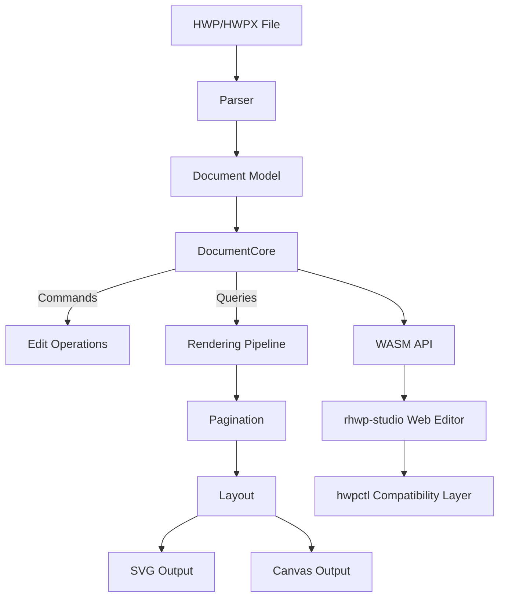

<p align="center">
  
</p>

<h1 align="center">rhwp</h1>

<p align="center">
  <strong>All HWP, Open for Everyone</strong><br/>
  <em>Open-source HWP document viewer & editor — Rust + WebAssembly</em>
</p>

<p align="center">
  <a href="https://github.com/edwardkim/rhwp/actions/workflows/ci.yml"></a>
  <a href="https://edwardkim.github.io/rhwp/"></a>
  <a href="https://www.npmjs.com/package/@rhwp/core"></a>
  <a href="https://marketplace.visualstudio.com/items?itemName=edwardkim.rhwp-vscode"></a>
  <a href="https://opensource.org/licenses/MIT"></a>
  <a href="https://www.rust-lang.org/"></a>
  <a href="https://webassembly.org/"></a>
</p>

<p align="center">
  <a href="README.md">한국어</a> | <strong>English</strong>
</p>

---

Open **HWP/HWPX files anywhere**. Free, no installation required.

**HWP** is the dominant document format in South Korea — used by government agencies, schools, courts, and most organizations. Until now, there has been no viable open-source solution to read or edit these files.

rhwp changes that. Built with Rust and compiled to WebAssembly, it renders HWP documents directly in the browser with accuracy that matches (and sometimes exceeds) the proprietary viewer. The goal: break the walls of a closed format so that every person, every AI, and every platform can read and write Korean documents freely.

> **[Live Demo](https://edwardkim.github.io/rhwp/)** | **[VS Code Extension](https://marketplace.visualstudio.com/items?itemName=edwardkim.rhwp-vscode)** | **[Open VSX](https://open-vsx.org/extension/edwardkim/rhwp-vscode)**

<p align="center">
  
</p>

## Roadmap

Build the skeleton solo, grow the muscle together, complete it as a public good.

```
0.5 ──── 1.0 ──── 2.0 ──── 3.0
Foundation  Typeset   Collab    Complete
```

| Phase | Direction | Strategy |
|-------|-----------|----------|
| **0.5 → 1.0** | Systematize the typesetting engine on a read/write foundation | Build core architecture solo, keep it solid |
| **1.0 → 2.0** | Open community participation on top of an AI-driven typesetting pipeline | Lower the barrier to contribution |
| **2.0 → 3.0** | Let community-built features elevate rhwp to a public asset | Reach parity with Hancom |

> The reason for completing the skeleton alone through v0.5.0 is simple — when the community arrives, the core architecture must already be solid so that direction does not drift.

## Milestones

### v0.5.0 ~ v0.7.x — Foundation (current)

> Reverse-engineering complete, read/write foundation established

- HWP 5.0 / HWPX parser, rendering for paragraphs, tables, equations, images, charts
- Pagination (multi-column split, table row split), headers/footers, master pages, footnotes
- SVG export (CLI) + Canvas rendering (WASM/Web)
- Web editor + hwpctl-compatible API (30 Actions, Field API)
- 1,100+ tests

#### v0.7.17 Cycle (2026-06-23)

> Patch after v0.7.16 — first OOXML chart render-fidelity work, legacy-shape shapeComment
> serialization, WASM options-object APIs, rhwp-studio table/picture/cursor editing fixes,
> and a dependency bump batch

**Rendering · charts**
- 2D-approximation routing for 7 OOXML chart types (3D-bar/3D-pie/ofPie) + bar stacking/percent (C1a)
- Keep v2 font authority on fallback, expand CanvasKit replay contract guards

**Save contract · API**
- Fixed missing shapeComment serialization on legacy shapes (ellipse/arc/polygon/curve/chart/ole)
- Added 26 WASM options-object APIs (`*Ex`, backward-compatible) + consumer README/manual

**rhwp-studio · extension**
- Table row/column insert-delete regression fix, autosave/recovery, local-font consent, picture/cursor fidelity, table-cell editing/protection
- Browser extension 0.2.6: viewer CSP fix, Chrome download interceptor side-effect removal

#### v0.7.16 Cycle (2026-06-19)

> Patch after v0.7.15 — HWPX save-contract (serializer fidelity) refinements, ClickHere
> guide-text Hancom compatibility, rhwp-studio drag-and-drop security gate, and rendering/
> table/picture fixes with many external contributor PRs

**HWPX Save Contract (serializer fidelity)**
- Preserved cell/text-box controls, linesegs, and captions; emit secPr margins and body
  column (colPr) from the IR instead of template hardcoding
- Preserved picture sizes, MEMO, shapeComment, registration axis, table pageBreak; lossless
  roundtrip for DocInfo/numbering and more
- Made parser autoNum width consistent, fixed newNum slot position, added enum-token surface check

**Hancom Compatibility · rhwp-studio**
- Fixed ClickHere (click-to-type) guide-text command format — resolves guide text not binding
  in the Hancom editor
- Drag-and-drop local file loading security gate (modal opt-in, extension/web common); ClickHere
  editing and dark theme

**Rendering · Other**
- Native PDF export API, Text IR v2 font-proof gates, endnote height SSOT, rotated-cell picture placement
- 27-sample chart corpus verification fixture; preserve mixed page sizes when printing

#### v0.7.15 Cycle (2026-06-06)

> Security patch — browser-extension service-worker fetch hardening, equation TAC flow/caret fixes,
> HWPX save-contract follow-ups, and browser extension v0.2.4 preparation

**Browser Extension Security**
- Hardened Chrome/Firefox service-worker document-fetch sender validation, internal/localhost/private URL blocking, and final redirect URL revalidation
- Uses `credentials: "omit"` for extension-side fetches and keeps automatically extracted thumbnail data out of the page DOM
- Chrome/Edge/Firefox extension v0.2.4: no new permissions and no new external network endpoints

**Equation and Endnote Flow**
- Improved wrapping and paragraph-indent handling for equation TAC-only lines
- Fixed caret movement across forced line breaks, equation TACs, endnote areas, and paragraph boundaries

**HWPX Save Contract**
- Fixed HWPX picture serialization for flip/rotation and `isEmbeded`
- Preserved HWPX diagonal cell-border `hh:slash` / `hh:backSlash` type values
- Preserved zero-length HWPX field ordering

#### v0.7.13 Cycle (2026-05-18 ~ 2026-05-26)

> Focused HWPX rendering/save compatibility fixes, exam/public-agency document regression fixes, and browser extension v0.2.3 preparation

**HWPX → HWP Save Compatibility**
- Improved table/cell axis contracts, cell LIST_HEADER materialization, gradient `BORDER_FILL`, cell inner margins, and cell background image fill mode serialization
- Implemented memo control serialization, memo style preservation, TOC field marker/page text output, page-number hide/restart controls, and related paragraph-control save paths
- Resolved multiple Hancom corruption/interrupted-render cases across `hwpx-h-01/02/03`, `mel-001`, `aift`, `exam_kor`, and `exam_social` fixtures

**HWPX Rendering Parity**
- Improved master pages (even/odd/last), headers/footers, paragraph numbering, paragraph borders, and exam passage boxes
- Improved textbox positioning, gradient fills, and rounded-corner rendering
- Improved SVG and web-canvas visual parity against Hancom-converted fixtures including `exam_kor.hwpx`, `exam_social.hwpx`, and `hwp3-sample16-hwp5.hwpx`

**Pagination and Layout Fixes**
- Fixed HWPX `treat_as_char` table LINE_SEG height over-inflation, nested table page splitting, picture pushdown/vpos double counting, and multi-column endnote vpos handling
- Improved caret movement around TAC shapes and repeated spaces

**Release and Extensions**
- Published `@rhwp/core` / `@rhwp/editor` v0.7.13 to npm
- Attached Linux/macOS/Windows CLI binaries and SHA-256 checksums to GitHub Release `v0.7.13`
- rhwp Chrome / Edge / Firefox extension v0.2.3 bundles rhwp core 0.7.13 WASM, adds local `file://` access guidance, and suppresses duplicate local-file downloads on Chrome/Edge

#### v0.7.12 Cycle (2026-05-12 ~ 2026-05-18)

> Patch cycle after v0.7.11 — 19 external contributor PRs plus the 7-PR @jangster77 series

**Core Regression Fixes**
- Split original Issue #952 into five focused defects and completed them: page-border basis, empty-caption phantom advance, column-relative picture advance, inline TAC line mapping before line breaks, and duplicate inline-equation emission inside textboxes
- Fixed WMF `SetTextAlign` vertical-bit interpretation and HWP3 empty-paragraph + page-break overflow page-count inflation
- Enabled release LTO / `codegen-units=1` / strip to reduce CLI and WASM artifact size

**rhwp-studio and APIs**
- Added F5 body block selection, F3 range extension, menu hotkey infrastructure, and page-number restart UI/API support
- Added `searchAllText`, `rhwpDev.goto()`, and the first document compare/history workflow
- Improved editing reliability around unsaved-change protection, external clipboard paste priority, and nested-table hit testing

**HWP3/WMF/EMF/Layout**
- Improved EMF/WMF image rendering, HWP3 tab-spec handling, and HWP3/HWPX external image references
- Fixed multiple regressions around header/footer picture rotation and mirroring, master-page table margins, equation Canvas/WASM rendering, and final-column flow

**Contributor Thanks**
- Contributors in this cycle: [@jangster77](https://github.com/jangster77), [@oksure](https://github.com/oksure), [@planet6897](https://github.com/planet6897), [@seo-rii](https://github.com/seo-rii), [@postmelee](https://github.com/postmelee), [@johndoekim](https://github.com/johndoekim), [@ubermensch1218](https://github.com/ubermensch1218), [@xogh3198](https://github.com/xogh3198), [@dragonnite1221-lgtm](https://github.com/dragonnite1221-lgtm)

#### v0.7.11 Cycle (2026-05-10 ~ 2026-05-11)

> Patch cycle after v0.7.10 — focused on Skia native raster, HWP3 native rendering, and rhwp-studio editing interactions

**Rendering and Layout**
- Advanced Skia native raster work for Issue #536: Layer IR contract hardening, text replay parity, and Text IR v2 compatibility contract
- Improved HWP3 native rendering through staged fixes against the 763-page `hwp3-sample10.hwp` oracle
- Organized Git LFS `pdf-large/` isolation and large-fixture handling

**rhwp-studio Editing UX**
- Improved scrollbar dragging, Korean IME chord-key detection, and the `Ctrl+N → Ctrl+M` shortcut adjustment to avoid Chrome-reserved shortcuts
- Fixed Alt/Option+Arrow word navigation, table-cell context preservation during drag selection, and line/document-end caret movement
- Added table-edit Undo/Redo, table-resize `SnapshotCommand`, multi-column/new-number dialogs, and Ctrl/Cmd+Arrow / Ctrl+E shortcuts

**Contributor Thanks**
- Contributors in this cycle: [@planet6897](https://github.com/planet6897), [@oksure](https://github.com/oksure), [@jangster77](https://github.com/jangster77), [@seo-rii](https://github.com/seo-rii), [@postmelee](https://github.com/postmelee), [@johndoekim](https://github.com/johndoekim), [@kihyunnn](https://github.com/kihyunnn)

#### v0.7.10 Cycle (2026-05-06)

> Patch cycle after v0.7.9 — absorbed 7 external contributors, introduced the AI/VLM PNG pipeline, and added the CLI binary release pipeline

**New Features and Infrastructure**
- Added the GitHub Release pipeline for Linux/macOS/Windows CLI binaries with SHA-256 checksums
- Added native Skia `PageLayerTree → PNG` export, the `native-skia` feature gate, and `DocumentCore::render_page_png_native(page)`
- Added the `export-png` CLI, `--vlm-target claude`, `--scale`, `--max-dimension`, `--font-path`, plus Korean/English manuals

**Layout and Rendering Fixes**
- Fixed HWP3 Square wrap cases, HWP3 conversion-identification heuristics, and the HWP 5.0 spec 0x18/0x1E swap
- Fixed cell inline TAC Shape margin + indent, TAC table `outer_margin_bottom`, inline table + equation paragraph shifts, choice-cell fraction paragraph routing, and cell-internal TopAndBottom image 1-line offsets
- Fixed PUA SVG output, exam_eng arrow glyph mapping, Square wrap table `horz_rel_to=Column`, and missing inline equation rendering

**Contributor Thanks**
- Contributors in this cycle: [@planet6897](https://github.com/planet6897), [@oksure](https://github.com/oksure), [@jangster77](https://github.com/jangster77), [@seo-rii](https://github.com/seo-rii), [@postmelee](https://github.com/postmelee), [@johndoekim](https://github.com/johndoekim), [@cskwork](https://github.com/cskwork)

#### v0.7.9 Cycle (2026-05-01)

> Task #501 (Hancom defensive logic for cell.padding) + cherry-pick of PR #428/#494/#478/#498 + 4 external contributors

**Maintainer Regression Fix**
- mel-001.hwp page 2 table cell height regression ([#501](https://github.com/edwardkim/rhwp/issues/501)) — added a Hancom-defensive-logic mimic guard for the case where `cell.padding > cell.height` (1700 HU vs 1280 HU). Wrote troubleshooting and wiki ([HWP Cell Padding Defensive Logic](https://github.com/edwardkim/rhwp/wiki/HWP-%EC%85%80-Padding-%EB%B0%A9%EC%96%B4-%EB%A1%9C%EC%A7%81))

**External PR Cherry-picks (3 PRs / 17 commits)**
- Picture serialization within group (external contribution by [@oksure](https://github.com/oksure) — PR [#428](https://github.com/edwardkim/rhwp/pull/428))
- `Paragraph::utf16_pos_to_char_idx` public API ([#484](https://github.com/edwardkim/rhwp/issues/484)) — external contribution by [@DanMeon](https://github.com/DanMeon), PR [#494](https://github.com/edwardkim/rhwp/pull/494)
- Layout/equation fixes bundled (7 Tasks / 10 commits — #488/#490/#483/#489/#495/#480/#476) — external contribution by [@planet6897](https://github.com/planet6897), PR [#478](https://github.com/edwardkim/rhwp/pull/478)

**Regression Verification Infrastructure (External)**
- Canvas visual diff pipeline (legacy Canvas ↔ PageLayerTree replay automated pixel diff, relates [#364](https://github.com/edwardkim/rhwp/issues/364)) — external contribution by [@seo-rii](https://github.com/seo-rii), PR [#498](https://github.com/edwardkim/rhwp/pull/498)

#### v0.7.8 Cycle (2026-04-29)

> Multiple external contributors + maintainer regression fixes + wiki/README organization — 15 external PRs cherry-picked

#### v0.7.7 Cycle (2026-04-27)

> v0.7.6 regression fix cycle — TypesetEngine pagination drift / page_num refresh / PartialTable + Square wrap (8 items consolidated)

#### Recent Changes (v0.7.3 / extension v0.2.1, 2026-04-21)

**rhwp-studio (library 0.7.3)**
- HWPX-source documents: save disabled with user notification ([#196](https://github.com/edwardkim/rhwp/issues/196)) — prevents data loss until the HWPX→HWP full converter ([#197](https://github.com/edwardkim/rhwp/issues/197)) lands
- HWPX→HWP IR mapping adapter assets preserved ([#178](https://github.com/edwardkim/rhwp/issues/178)) — rhwp self-roundtrip 100% recovered; Hancom compatibility deferred to #197
- HWPX interleaved control char-offset fix for linebreak/embedded controls ([#213](https://github.com/edwardkim/rhwp/pull/213) by @jskang / [@yl-star7](https://github.com/yl-star7))
- OLE / Chart / EMF native rendering — `<hp:pic>` placeholders, OOXML chart SVG, and native Skia-free EMF → SVG converter for the first time (external contribution by [@planet6897](https://github.com/planet6897) — PR [#221](https://github.com/edwardkim/rhwp/pull/221), 14-stage work)
- HWPX SVG snapshot regression harness ([#173](https://github.com/edwardkim/rhwp/issues/173)) with `UPDATE_GOLDEN=1` regeneration (external contribution by [@seunghan91](https://github.com/seunghan91) — PR [#181](https://github.com/edwardkim/rhwp/pull/181))
- Polygon resize + drag preview + shape-click-to-front (external contribution by [@bapdodi](https://github.com/bapdodi) — PR [#215](https://github.com/edwardkim/rhwp/pull/215))
- Rotated shape resize cursor improvement + Flip handling (external contribution by [@bapdodi](https://github.com/bapdodi) — PR [#192](https://github.com/edwardkim/rhwp/pull/192))
- HWP image effects (grayscale/black-and-white) reflected in SVG (external contribution by [@marsimon](https://github.com/marsimon) — PR [#149](https://github.com/edwardkim/rhwp/pull/149))
- Windows CFB path separator fix (external contribution by [@dreamworker0](https://github.com/dreamworker0) — PR [#152](https://github.com/edwardkim/rhwp/pull/152))
- HWPX Serializer — Document IR → HWPX save (external contribution by [@seunghan91](https://github.com/seunghan91) — PR [#170](https://github.com/edwardkim/rhwp/pull/170))
- HWPX ZIP entry decompression cap + strikeout shape whitelist (external contribution by [@seunghan91](https://github.com/seunghan91) — PR [#153](https://github.com/edwardkim/rhwp/pull/153), PR [#154](https://github.com/edwardkim/rhwp/pull/154))
- Shape resize width/height clamp (external contribution by [@seunghan91](https://github.com/seunghan91) — PR [#163](https://github.com/edwardkim/rhwp/pull/163))
- Mobile dropdown menu icon/label overlap fix (external contribution by [@seunghan91](https://github.com/seunghan91) — PR [#161](https://github.com/edwardkim/rhwp/pull/161))

**rhwp-chrome / Edge extension (v0.2.1)**
- Chrome Web Store and Microsoft Edge Add-ons approved (2026-04-21)
- Restored "remember last save location" for general file downloads while the extension is active ([#198](https://github.com/edwardkim/rhwp/issues/198))
- Options page CSP fix ([#166](https://github.com/edwardkim/rhwp/issues/166))
- CodeQL alert #16 (shell injection in build.mjs) resolved via `execFileSync` migration
- HWP files: `Ctrl+S` overwrites the same file directly (external contribution by [@ahnbu](https://github.com/ahnbu) — PR [#189](https://github.com/edwardkim/rhwp/pull/189))
- Thumbnail loading spinner cleanup + options CSP compatibility (external contribution by [@postmelee](https://github.com/postmelee) — PR [#168](https://github.com/edwardkim/rhwp/pull/168))
- Block empty viewer tab on DEXT5-style download handlers

**rhwp-firefox extension (v0.1.1, AMO submission pending)**
- Firefox MV3 port of rhwp-chrome with `browser.*` namespace, Event Page background, and CSP-compatible options (external contribution by [@postmelee](https://github.com/postmelee) — PR [#169](https://github.com/edwardkim/rhwp/pull/169))
- `__APP_VERSION__` regression fix in `vite.config.ts` (external contribution by [@postmelee](https://github.com/postmelee) — PR [#209](https://github.com/edwardkim/rhwp/pull/209))
- Shared `rhwp-shared/sw/download-interceptor-common.js` module with #198 blacklist / MIME logic wired into Firefox's `onCreated`+`onChanged` dual-callback flow (external contribution by [@postmelee](https://github.com/postmelee) — PR [#214](https://github.com/edwardkim/rhwp/pull/214))

**rhwp-safari extension (v0.2.1)**
- Content-script `init()` gate split to honor hoverPreview / autoOpen independently from showBadges (external contribution by [@postmelee](https://github.com/postmelee) — PR [#224](https://github.com/edwardkim/rhwp/pull/224))

**Thanks to contributors**
v0.7.x cycle cumulative external contributors: [@ahnbu](https://github.com/ahnbu), [@bapdodi](https://github.com/bapdodi), [@cskwork](https://github.com/cskwork), Dangel, [@DanMeon](https://github.com/DanMeon), [@dragonnite1221-lgtm](https://github.com/dragonnite1221-lgtm), [@dreamworker0](https://github.com/dreamworker0), [@jangster77](https://github.com/jangster77), [@johndoekim](https://github.com/johndoekim), [@kihyunnn](https://github.com/kihyunnn), [@marsimon](https://github.com/marsimon), [@oksure](https://github.com/oksure), [@planet6897](https://github.com/planet6897), [@postmelee](https://github.com/postmelee), [@seanshin](https://github.com/seanshin), [@seo-rii](https://github.com/seo-rii), [@seunghan91](https://github.com/seunghan91), [@ubermensch1218](https://github.com/ubermensch1218), [@xogh3198](https://github.com/xogh3198), [@yl-star7](https://github.com/yl-star7)

### v1.0.0 — Typesetting Engine

> AI-driven typesetting pipeline, skeleton complete

- Systematic dynamic reflow on edit (LINE_SEG recomputation + pagination integration)
- AI-driven document generation and editing pipeline
- Document typesetting quality on par with Hancom's viewer

### v2.0.0 — Collaboration

> Community fills out the feature surface — growing the muscle

- Plugin / extension architecture, real-time collaborative editing
- Additional output formats (PDF, DOCX, etc.)

### v3.0.0 — Completion

> On par with Hancom, a full public asset

- Complete HWP feature coverage, accessibility (a11y), mobile support
- Ready for front-line use in government and public institutions

See the [roadmap document](mydocs/eng/report/rhwp-milestone.md) for details.

---

## Features

### Parsing
- HWP 5.0 binary format (OLE2 Compound File)
- HWPX (Open XML-based format)
- Sections, paragraphs, tables, textboxes, images, equations, charts
- Header/footer, master pages, footnotes/endnotes

### Rendering
- **Paragraph layout**: line spacing, indentation, alignment, tab stops
- **Tables**: cell merging, border styles (solid/double/triple/dotted), cell formula calculation
- **Multi-column layout** (2-column, 3-column, etc.)
- **Paragraph numbering/bullets**
- **Vertical text**
- **Header/footer** (odd/even page separation)
- **Master pages** (Both/Odd/Even, is_extension/overlap)
- **Object placement**: TopAndBottom, treat-as-char (TAC), in-front-of/behind text
- **Image crop & border rendering**
- **OLE / Chart / EMF** native rendering (since v0.7.3)

### Equation
- Fractions (OVER), square roots (SQRT/ROOT), subscript/superscript
- Matrices: MATRIX, PMATRIX, BMATRIX, DMATRIX
- Cases, alignment (EQALIGN), stacking (PILE/LPILE/RPILE)
- Large operators: INT, DINT, TINT, OINT, SUM, PROD
- Relations (REL/BUILDREL), limits (lim), long division (LONGDIV)
- 15 text decorations, full Greek alphabet, 100+ math symbols

### Pagination
- Multi-column document column/page splitting
- Table row-level page splitting (PartialTable)
- shape_reserved handling for TopAndBottom objects
- vpos-based paragraph position correction

### Output
- SVG export (CLI, legacy + layer replay)
- Canvas rendering (WASM/Web)
- HWP save path for native HWP editing and HWPX → HWP conversion
- Debug overlay (paragraph/table boundaries + indices + y-coordinates)

### Multi-Renderer Backends
- `PageRenderTree` can be lowered into a `PageLayerTree` paint IR before backend replay.
- P1 public surfaces are Rust native `DocumentCore::build_page_layer_tree(page)` and WASM `getPageLayerTree(page)`.
- Layer JSON starts at `schemaVersion: 1`, uses additive `schemaMinorVersion` / `resourceTableMinorVersion`, `unit: "px"`, and `coordinateSystem: "page-top-left-y-down"` to match the existing page render coordinates.
- Compatible schema changes should be additive; incompatible JSON shape changes require a schema version bump.
- **Legacy SVG** remains the default compatibility output.
- **Layered SVG** can be exercised with `RHWP_RENDER_PATH=layer-svg`.
- The layered SVG path is a transition adapter that expands `PageLayerTree` back into the existing SVG renderer.
- Browser/native Canvas paths render through `PageLayerTree` replay by default.
- Legacy Canvas remains available through `renderPageCanvasLegacy` / `renderPageToCanvasLegacy` for parity checks.
- P3 visual regression coverage runs `npm run e2e:render-diff:ci` in `rhwp-studio` to compare legacy Canvas and layer Canvas in Chromium; CI uploads render-diff artifacts and writes a summary.
- The default render-diff fixtures cover basic text/table output, business-document layout, and treat-as-char object placement; override with `RHWP_RENDER_DIFF_FILES`, `RHWP_RENDER_DIFF_MAX_PAGES`, or `RHWP_RENDER_DIFF_ALL=1`.
- P4 adds native-only `DocumentCore::render_page_png_native(page)` behind `--features native-skia`; it renders `PageLayerTree` to encoded PNG through `SkiaLayerRenderer`.
- P5 adds native Skia equation replay from `EquationNode.layout_box`, so equations are no longer placeholder boxes in the PNG path.
- P5 replays the existing equation layout tree directly; it does not add CanvasKit equation replay or native form replay.
- P6 adds native Skia `RawSvg` fragment rasterization through `resvg`, with external file href loading disabled.
- P21 adds report-first renderer baseline sweep artifacts and shared replay-plane helpers so SVG, Canvas2D, CanvasKit, and native Skia compare the same background/behindText/flow/inFrontText plane ordering before the sweep becomes a default CI gate.
- P22 keeps public Canvas on the existing layer path but reduces the WebCanvas layer adapter: core `PaintOp` leaves are replayed directly instead of being rebuilt as temporary `RenderNode` wrappers. Layer JSON also separates canonical `buildOptions`, `debugOptions`, and replay `outputOptions` metadata while keeping legacy `outputOptions` mirrors for compatibility.
- P23 promotes SVG-derived PDF export to native `DocumentCore` APIs for single-page, explicit page selection, and full-document export. The CLI `export-pdf` command now uses the same native API surface, and render-diff CI writes a report-only PDF visual diff by rasterizing `export-pdf` output against browser Canvas output. Direct/vector PDF replay remains a follow-up.
- P24-P27 harden strict text/glyph sidecar proof boundaries: bitmap/SVG glyph resource identity, variation/TTC/dataRef/digest proof, guarded orientation/transform authority, and font resolver/proof separation. `TextRun` remains the compatibility fallback whenever proof is incomplete.
- CI covers the native Skia path with `cargo test --features native-skia skia --lib`; the feature is not available on `wasm32` targets.
- The initial native Skia path is a PNG raster backend with core image/equation/raw-svg replay; full CanvasKit glyph replay, exact native glyph replay, real document font blob extraction, complex text shaping, advanced image parity, and native form replay stay as follow-up work.
- C ABI export is intentionally left for a later PR.
- `ResourceArena` now supports interned image, static SVG, and font blob resources for guarded replay proof; broader document extraction and full resource transport remain follow-up work.
- This phase establishes the frontend/backend boundary for later CanvasKit and fuller native Skia backends.

### Web Editor
- Text editing (insert, delete, undo/redo)
- Character/paragraph formatting dialogs
- Table creation, row/column insert/delete, cell formula
- hwpctl-compatible API layer (Hancom WebGian compatible)

### hwpctl Compatibility
- 30 Actions: TableCreate, InsertText, CharShape, ParagraphShape, etc.
- ParameterSet/ParameterArray API
- Field API: GetFieldList, PutFieldText, GetFieldText
- Template data binding support

## npm Packages — Use in Your Web Project

Current release: `@rhwp/core` / `@rhwp/editor` v0.7.17.

### Embed a Full Editor (3 lines)

Embed the complete HWP editor in your web page — menus, toolbars, formatting, table editing, everything included.

```bash
npm install @rhwp/editor
```

```html
<div id="editor" style="width:100%; height:100vh;"></div>
<script type="module">
  import { createEditor } from '@rhwp/editor';
  const editor = await createEditor('#editor');
</script>
```

### HWP Viewer/Parser (Direct API)

Use the WASM-based parser/renderer directly to render HWP files as SVG.

```bash
npm install @rhwp/core
```

```javascript
import init, { HwpDocument } from '@rhwp/core';

globalThis.measureTextWidth = (font, text) => {
  const ctx = document.createElement('canvas').getContext('2d');
  ctx.font = font;
  return ctx.measureText(text).width;
};

await init({ module_or_path: '/rhwp_bg.wasm' });

const resp = await fetch('document.hwp');
const doc = new HwpDocument(new Uint8Array(await resp.arrayBuffer()));
document.getElementById('viewer').innerHTML = doc.renderPageSvg(0);
```

| Package | Purpose | Install |
|---------|---------|---------|
| [@rhwp/editor](https://www.npmjs.com/package/@rhwp/editor) | Full editor UI (iframe embed) | `npm i @rhwp/editor` |
| [@rhwp/core](https://www.npmjs.com/package/@rhwp/core) | WASM parser/renderer (API) | `npm i @rhwp/core` |

## Quick Start (Build from Source)

New contributors: start with the [onboarding guide](mydocs/eng/manual/onboarding_guide.md). It covers project architecture, debugging tools, and the development workflow at a glance.

### Requirements
- Rust 1.93.1 (pinned by `rust-toolchain.toml`)
- Docker (for WASM build)
- Node.js 18+ (for web editor)

### Native Build

```bash
cargo build                    # Development build
cargo build --release          # Release build
cargo test                     # Run tests (1,100+ tests)
```

### WASM Build

The WASM build uses Docker to guarantee an identical `wasm-pack` + Rust toolchain environment across every platform.

```bash
cp .env.docker.example .env.docker   # First time: copy env template
docker compose --env-file .env.docker run --rm wasm
```

Build output goes to `pkg/`.

### Web Editor

```bash
cd rhwp-studio
npm install
npx vite --host 0.0.0.0 --port 7700
```

Open `http://localhost:7700` in your browser.

## CLI Usage

### SVG Export

```bash
rhwp export-svg sample.hwp                         # Export to output/
rhwp export-svg sample.hwp -o my_dir/              # Export to custom directory
rhwp export-svg sample.hwp -p 0                    # Export specific page (0-indexed)
rhwp export-svg sample.hwp --debug-overlay         # Debug overlay (paragraph/table boundaries)
```

### Document Inspection

```bash
rhwp dump sample.hwp                  # Full IR dump
rhwp dump sample.hwp -s 2 -p 45      # Section 2, paragraph 45 only
rhwp dump-pages sample.hwp -p 15     # Page 16 layout items
rhwp info sample.hwp                  # File info (size, version, sections, fonts)
```

### Debugging Workflow

1. `export-svg --debug-overlay` → Identify paragraphs/tables by `s{section}:pi={index} y={coord}`
2. `dump-pages -p N` → Check paragraph layout list and heights
3. `dump -s N -p M` → Inspect ParaShape, LINE_SEG, table properties

No code modification needed for the entire debugging process.

## Project Structure

```
src/
├── main.rs                    # CLI entry point
├── parser/                    # HWP/HWPX file parser
├── model/                     # HWP document model
├── document_core/             # Document core (CQRS: commands + queries)
│   ├── commands/              # Edit commands (text, formatting, tables)
│   ├── queries/               # Queries (rendering data, pagination)
│   └── table_calc/            # Table formula engine (SUM, AVG, PRODUCT, etc.)
├── renderer/                  # Rendering engine
│   ├── layout/                # Layout (paragraph, table, shapes, cells)
│   ├── pagination/            # Pagination engine
│   ├── equation/              # Equation parser/layout/renderer
│   ├── svg.rs                 # SVG output
│   └── web_canvas.rs          # Canvas output
├── emf/                       # EMF parser + SVG converter (since v0.7.3)
├── ooxml_chart/               # OOXML chart parser + SVG renderer (since v0.7.3)
├── serializer/                # HWP file serializer (save)
└── wasm_api.rs                # WASM bindings

rhwp-studio/                   # Web editor (TypeScript + Vite)
├── src/
│   ├── core/                  # Core (WASM bridge, types)
│   ├── engine/                # Input handlers
│   ├── hwpctl/                # hwpctl compatibility layer
│   ├── ui/                    # UI (menus, toolbars, dialogs)
│   └── view/                  # Views (ruler, status bar, canvas)
├── e2e/                       # E2E tests (Puppeteer + Chrome CDP)
│   └── helpers.mjs            # Test helpers (headless/host modes)

rhwp-chrome/                   # Chrome / Edge extension
rhwp-firefox/                  # Firefox extension (MV3)
rhwp-safari/                   # Safari Web Extension
rhwp-shared/                   # Shared code between browser extensions

mydocs/                        # Project documentation (Korean)
├── orders/                    # Daily task tracking
├── plans/                     # Task plans and implementation specs
├── feedback/                  # Code review feedback
├── tech/                      # Technical documents
└── manual/                    # Manuals and guides
mydocs/eng/                    # English translations (2,200+ files)

scripts/                       # Build & quality tools
├── metrics.sh                 # Code quality metrics collection
└── dashboard.html             # Quality dashboard with trend tracking
```

## Built with AI Pair Programming

> **This is not vibe coding.** There is no "just accept what AI gives you." Every plan is reviewed. Every output is verified. Every decision has a human behind it.

Vibe coding — hitting accept without reading, letting AI make architectural decisions, shipping code you don't understand — is a trap. It produces code that *looks* right but breaks in ways you can't diagnose, because you never understood it in the first place.

This project takes the opposite approach. A human **task director** maintains full ownership of direction, quality, and architectural decisions, while AI handles implementation at a speed and scale that would be impossible alone. The key difference: **the human never stops thinking.**

### Vibe Coding vs. Directed AI Development

| | Vibe Coding | This Project |
|--|-------------|-------------|
| **Human role** | Accept AI output | Direct, review, decide |
| **Planning** | None — "just build it" | Written plan → approval → execution |
| **Quality gate** | Hope it works | 1,100+ tests + Clippy + CI + code review |
| **Debugging** | Ask AI to fix AI's bugs | Human diagnoses, AI implements fix |
| **Architecture** | Emergent (accidental) | Deliberate (CQRS, dependency direction) |
| **Documentation** | None | 2,200+ files of process records |
| **Outcome** | Fragile, hard to maintain | Production-grade, 100K+ lines |

AI is a force multiplier, but a multiplier amplifies whatever process you already have. No process × AI = fast chaos. Good process × AI = extraordinary output.

### The Development Process

This project is developed using **[Claude Code](https://claude.ai/code)** (Anthropic's AI coding agent) as a pair programming partner. The entire development process is transparently documented.

```
Task Director (Human)              AI Pair Programmer (Claude Code)
─────────────────────              ────────────────────────────────
Sets direction & priorities   →    Analyzes, plans, implements
Reviews & approves plans      ←    Writes implementation plans
Provides domain feedback      →    Debugs, tests, iterates
Makes architectural decisions →    Executes with precision
Judges quality & correctness  ←    Generates code, docs, tests
```

The `mydocs/` directory (2,200+ files, English translations in `mydocs/eng/`) contains the complete development record: daily task logs, implementation plans, code review feedback, technical research documents, and debugging records.

> `mydocs/` is not documentation about the code — it is documentation about **how to build software with AI**. It is an open-source methodology.

**[Hyper-Waterfall Methodology](mydocs/eng/manual/hyper_waterfall.md)** — macro-level waterfall + micro-level agile, both made possible at once by AI.

### Git Workflow

```
local/task{N}  ──commit──commit──┐
                                  ├─→ devel merge (grouped by related tasks)
                                  ├─→ main merge + tag (release time)
```

| Branch | Purpose |
|--------|---------|
| `main` | Release (tags: v0.5.0 etc.) |
| `devel` | Development integration |
| `local/task{N}` | GitHub Issue-numbered task branch |

### Task Management

- **GitHub Issues** auto-number tasks — no duplicates
- **GitHub Milestones** group related tasks
- Milestone notation: `M{version}` (e.g. M100=v1.0.0, M05x=v0.5.x)
- Daily tasks: `mydocs/orders/yyyymmdd.md` — referenced as `M100 #1`
- Commit messages: `Task #1: <subject>` — `closes #1` auto-closes the issue

### Task Workflow

1. `gh issue create` → register a GitHub Issue (with a milestone)
2. Create `local/task{issue-number}` branch
3. Write an implementation plan → approval → implement → test
4. Merge to `devel` → `closes #{number}`

### Debugging Protocol

1. `export-svg --debug-overlay` → Identify paragraphs/tables
2. `dump-pages -p N` → Inspect the layout item list and heights
3. `dump -s N -p M` → Inspect ParaShape, LINE_SEG details

> The documents under `mydocs/` double as educational material for AI-driven software development.

### Documentation Rules

All project documents are written in **Korean** (with English translations under `mydocs/eng/`).

```
mydocs/
├── orders/           # Daily task logs (yyyymmdd.md)
├── plans/            # Task plans & implementation specs
│   └── archives/     # Archived completed plans
├── working/          # Step-by-step completion reports
├── report/           # Main reports
├── feedback/         # Code review feedback
├── tech/             # Technical documents
├── manual/           # Manuals and guides
└── troubleshootings/ # Troubleshooting records
```

| Document type | Location | Naming rule |
|---------------|----------|-------------|
| Daily task log | `orders/` | `yyyymmdd.md` — references milestone(M100) + issue(#1) |
| Task plan | `plans/` | References the issue number |
| Completion report | `working/` | References the issue number |
| Technical doc | `tech/` | Free-form by topic |

## Architecture



## HWPUNIT

- 1 inch = 7,200 HWPUNIT
- 1 inch = 25.4 mm
- 1 HWPUNIT ≈ 0.00353 mm

## Contributing

Contributions are welcome. Please note the following first:

- **Target branch for PRs is `devel`**, not `main`. Although the GitHub default branch is `main`, all contributor PRs go to `devel`.
- **Check first**: Look at [open issues](https://github.com/edwardkim/rhwp/issues) and [open PRs](https://github.com/edwardkim/rhwp/pulls) to avoid duplicating in-progress work.
- **Issue close is by maintainer**: Submit only the PR for completed work. The maintainer will close the issue when the PR is merged.
- **Hancom PDFs are not authoritative ground truth**: PDF output differs across Hancom tools (Editor / Viewer / Hancom Docs), versions (2010 / 2020 / 2022), and output paths (Hancom-native / OS print). See the [Hancom PDF Environment Dependency wiki](https://github.com/edwardkim/rhwp/wiki/한컴-PDF-환경-의존성) for environment-specific comparison data and PR review guidance.

For the full contribution flow (fork → branch → commit → PR), see [CONTRIBUTING.md](CONTRIBUTING.md).

Questions and ideas are welcome on [Discussions](https://github.com/edwardkim/rhwp/discussions).

### Wiki Resources

Authoritative resources useful to contributors and fork users are organized in the [Wiki](https://github.com/edwardkim/rhwp/wiki):

- [Hancom PDF Environment Dependency](https://github.com/edwardkim/rhwp/wiki/한컴-PDF-환경-의존성) — PDF differences across Hancom tools / versions / OS, and PR verification guidance
- [HWP 5.0 Spec Errata](https://github.com/edwardkim/rhwp/wiki/HWP-5.0-Spec-Errata) — HWP 5.0 spec errata
- [Understanding HWP LINE_SEG vpos](https://github.com/edwardkim/rhwp/wiki/HWP-LINE_SEG-vpos-이해)
- [HWP Tab Leader Rendering](https://github.com/edwardkim/rhwp/wiki/HWP-Tab-Leader-Rendering)
- [Export API Guide](https://github.com/edwardkim/rhwp/wiki/Export-API-사용-가이드) — exportHwp / exportHwpx APIs
- [Cloudflared for rhwp-studio external HTTPS access](https://github.com/edwardkim/rhwp/wiki/Cloudflared-로-rhwp-studio-외부-HTTPS-접근)
- [Hyper-Waterfall Document Guide](https://github.com/edwardkim/rhwp/wiki/Hyper‐Waterfall-문서-체계-가이드)
- [Investigation PR Guide](https://github.com/edwardkim/rhwp/wiki/Investigation-PR-가이드)
- [Legal FAQ](https://github.com/edwardkim/rhwp/wiki/Legal-FAQ)

## Notice

This product was developed with reference to the HWP (.hwp) file format specification published by Hancom Inc.

## Trademark

"Hangul", "Hancom", "HWP", and "HWPX" are registered trademarks of Hancom Inc.
This project is an independent open-source project with no affiliation, sponsorship, or endorsement by Hancom Inc.

## License

[MIT License](LICENSE) — Copyright (c) 2025-2026 Edward Kim
